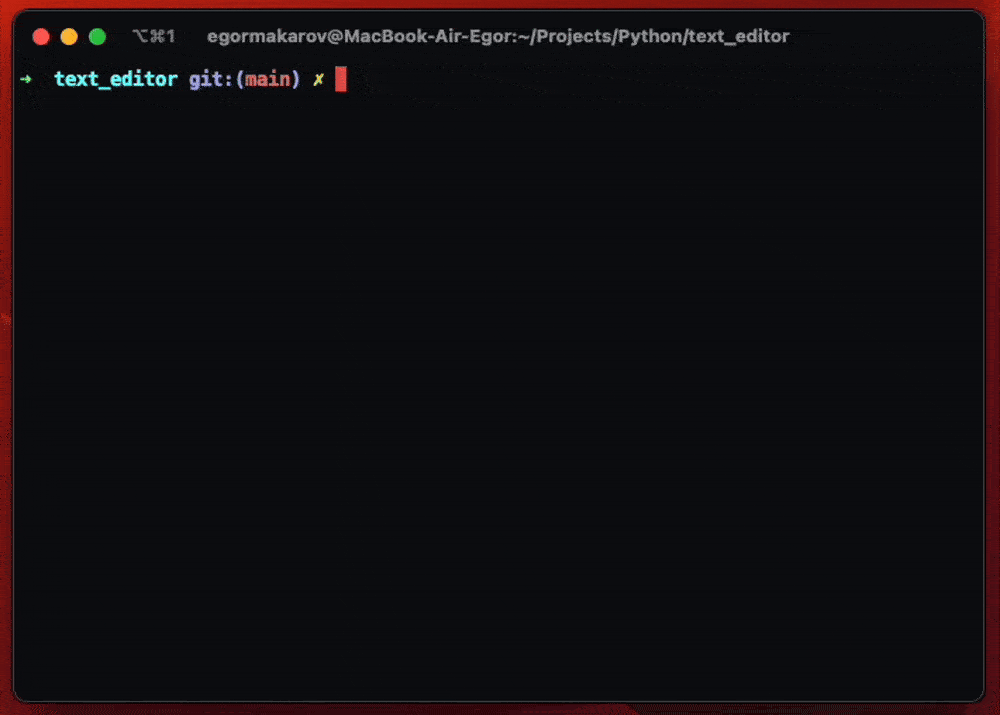

# EMS text editor
This project is a terminal, vim-like, text editor built in Python using curses library.

<p align="center">
  
</p>

This project does not use any prebuilt textbox solutions, the whole functionality was made from scratch.

## Usage
Run the file `run.py` and specify the file name. If file does not exists it will be created.
``` bash 
python3 run.py <filename>
```
To exit press escape or type `/q<Enter>`.  
To go into insert mode press `i`.  
To go back to normal mode press escape.  
To save changes type `/w` while in normal mode.  
You can use `h j k l` or arrow keys to move the cursor.
## Buffer
There are two implementations of a buffer which stores the contents of a file. 

First one uses an **array of strings** which is not a great solution, because arrays have a fixed size and if you go beyond that size you will have to relocate the whole array to another place in memory which is a costy operation, but its good enough to implement as the first version (see file `src/array_buffer.py`).

Second one uses a **gap buffer** and a **linked list** which is much more efficient than using arrays (see file `src/gap_buffer.py`). Each line in the file is a linked list node which has a link to the previous and next nodes.

You can switch between the two buffers by changing the related import in `src/text_editor.py` file.

For gap buffer
```python
from src.gap_buffer import Buffer
```

For array buffer
```python
from src.gap_buffer import Buffer
```